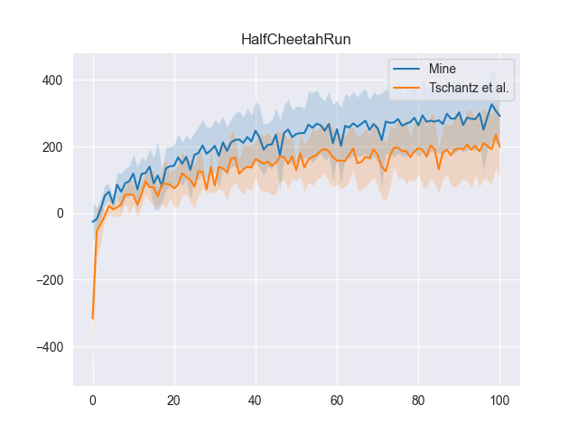
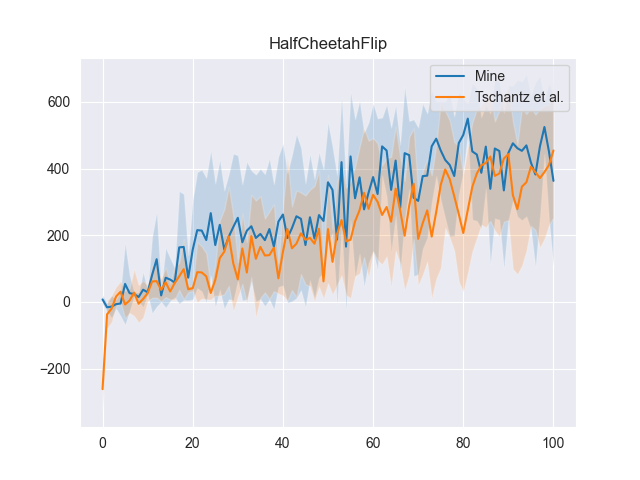

# Active Inference

Application of active inference to reinforcement learning.

Based on repo https://github.com/alec-tschantz/rl-inference to compare their approach vs mine.

Derivation of approach and results can be found at: https://r-gould.github.io/2023/08/15/free-energy.html

  
  

